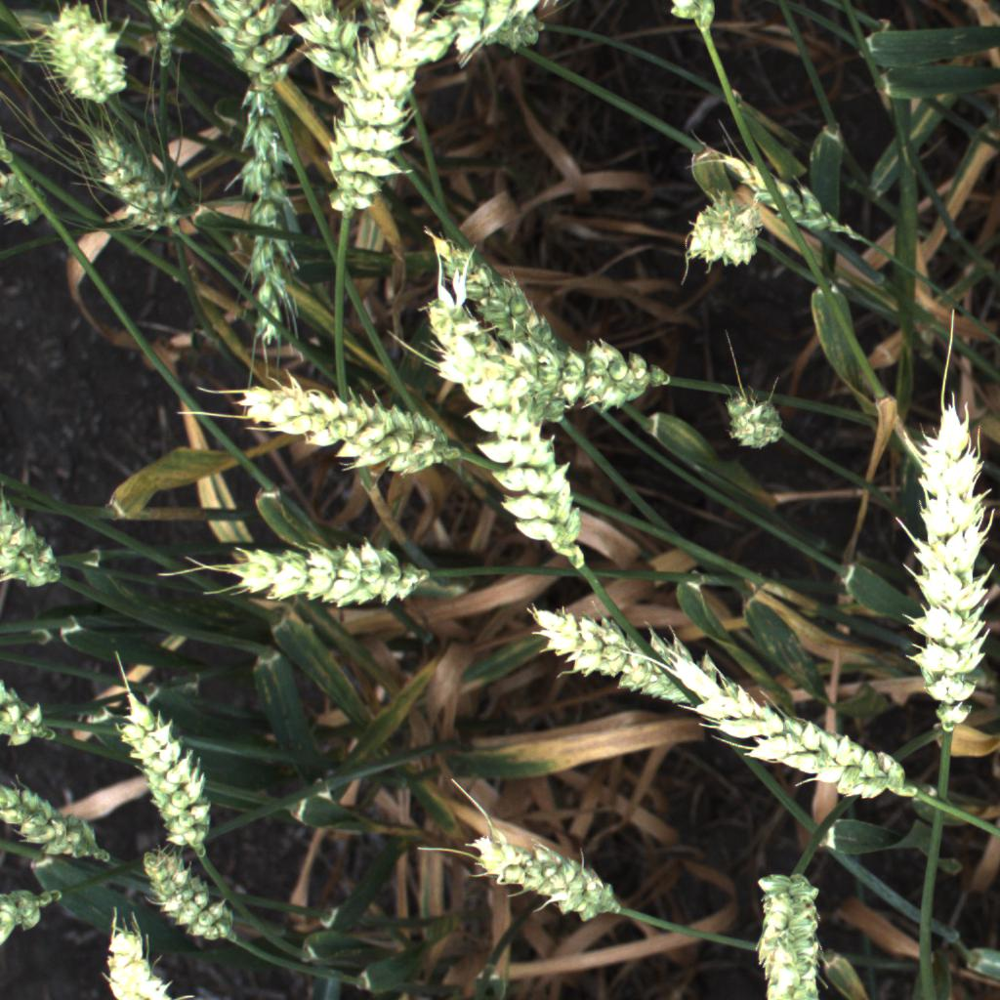

# Global wheat detection

## Description

</img>

Example of the object detection using YOLO v5 algorithm.

We will follow next steps:

1. EDA

2. Installing YOLOv5

3. Preprocessing data for YOLOv5

4. Modeling

Dataset can be found https://www.kaggle.com/c/global-wheat-detection/data or by using kaggle api

`kaggle competitions download -c global-wheat-detection`